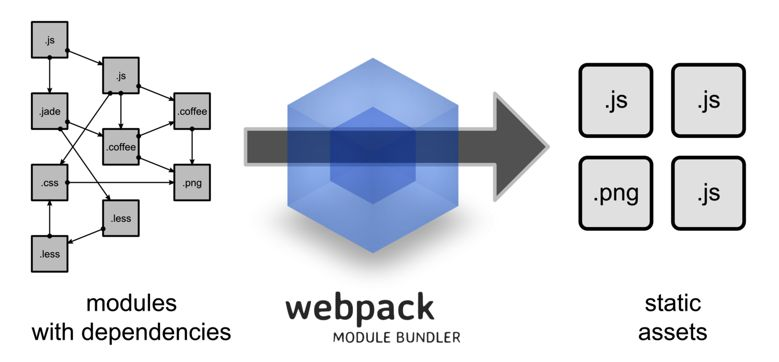

# What is WebPack?
`WebPack` 可以看做是模块打包机：它做的事情是，分析你的项目结构，找到 `JavaScript` 模块以及其它的一些浏览器不能直接运行的拓展语言（`Scss`, `TypeScript` 等），并将其打包为合适的格式以供浏览器使用。



构建就是把源代码转换成发布到线上的可执行 `JavaScrip`、`CSS`、`HTML` 代码，包括如下内容。
- 代码转换：TypeScript 编译成 JavaScript、SCSS 编译成 CSS 等。
- 文件优化：压缩 JavaScript、CSS、HTML 代码，压缩合并图片等。
- 代码分割：提取多个页面的公共代码、提取首屏不需要执行部分的代码让其异步加载。
- 模块合并：在采用模块化的项目里会有很多个模块和文件，需要构建功能把模块分类合并成一个文件。
- 自动刷新：监听本地源代码的变化，自动重新构建、刷新浏览器。
- 代码校验：在代码被提交到仓库前需要校验代码是否符合规范，以及单元测试是否通过。
- 自动发布：更新完代码后，自动构建出线上发布代码并传输给发布系统。

构建其实是工程化、自动化思想在前端开发中的体现，把一系列流程用代码去实现，让代码自动化地执行这一系列复杂的流程。 构建给前端开发注入了更大的活力，解放了我们的生产力。

# 初始化项目
```bash
mkdir webpack-practice
cd webpack-practice
npm init -y
```

# 快速上手
## webpack 核心概念
- Entry：入口，Webpack 执行构建的第一步将从 Entry 开始，可抽象成输入。
- Module：模块，在 Webpack 里一切皆模块，一个模块对应着一个文件。Webpack 会从配置的 Entry 开始递归找出所有依赖的模块。
- Chunk：代码块，一个 Chunk 由多个模块组合而成，用于代码合并与分割。
- Loader：模块转换器，用于把模块原内容按照需求转换成新内容。
- Plugin：扩展插件，在 Webpack 构建流程中的特定时机注入扩展逻辑来改变构建结果或做你想要的事情。
- Output：输出结果，在 Webpack 经过一系列处理并得出最终想要的代码后输出结果。
- context: context 即是项目打包的路径上下文，如果指定了 context ,那么 entry 和output 都是相对于上下文路径的，contex必须是一个绝对路径

> Webpack 启动后会从Entry里配置的Module开始递归解析 Entry 依赖的所有 Module。 每找到一个 Module， 就会根据配置的Loader去找出对应的转换规则，对 Module 进行转换后，再解析出当前 Module 依赖的 Module。 这些模块会以 Entry 为单位进行分组，一个 Entry 和其所有依赖的 Module 被分到一个组也就是一个 Chunk。最后 Webpack 会把所有 Chunk 转换成文件输出。 在整个流程中 Webpack 会在恰当的时机执行 Plugin 里定义的逻辑。

## 配置 webpack
```bash
npm install webpack webpack-cli -D
```

## 创建 src 目录
```bash
mkdir src
```

## 创建 dist 目录
这个目录为打包后的文件目录，可自动创建。
```bash
mkdir dist
```

## 基本配置文件
webpack.config.js

```js
const path=require('path');
module.exports = {
  context:process.cwd(),
    entry: './src/index.js',
    output: {
        path: path.resolve(__dirname,'dist'),
        filename:'bundle.js'
    },
    module: {},
    plugins: [],
    devServer: {}
}
```

- 创建 dist
    - 创建index.html
- 配置文件webpack.config.js
    - entry：配置入口文件的地址
    - output：配置出口文件的地址
    - module：配置模块,主要用来配置不同文件的加载器
    - plugins：配置插件
    - devServer：配置开发服务器

##  创建 index.html 文件
在 dist 目录下创建 index.html 文件，手动把打包后的 bundle.js 引入进来
```html
<!DOCTYPE html>
<html lang="en">
<head>
    <meta charset="UTF-8">
    <meta name="viewport" content="width=device-width, initial-scale=1.0">
    <meta http-equiv="X-UA-Compatible" content="ie=edge">
    <title>Document</title>
</head>
<body>
<div id="root"></div>
<script src="bundle.js"></script>
</body>
</html>
```

## mode
Providing the mode configuration option tells webpack to use its built-in optimizations accordingly.

webpack 的 mode 配置用于提供模式配置选项告诉 webpack 相应地使用其内置的优化，mode 有以下三个可选值
- development
- production
- none
### 使用
Provide the `mode` option in the config:

在配置选项中设置 `mode` 属性
```js
module.exports = {
  mode: 'development'
};
```

or pass it as a `CLI` argument:

或者通过命令行形式设置
```bash
webpack --mode=development
```

The following string values are supported:

支持以下字符值：
**options** | **description** 
:-|:-|:-
`development` | Sets `process.env.NODE_ENV` on `DefinePlugin` to value `development` . Enables `NamedChunksPlugin` and `NamedModulesPlugin` . |
`production` | Sets `process.env.NODE_ENV` on `DefinePlugin` to value `production` . Enables `FlagDependencyUsagePlugin` , `FlagIncludedChunksPlugin` , `ModuleConcatenationPlugin` , `NoEmitOnErrorsPlugin` , `OccurrenceOrderPlugin` , `SideEffectsFlagPlugin` and `TerserPlugin` . |
`none` | Opts out of any default optimization options

如果没有设置 mode 属性，则默认为 productions

common
```bash
//parent chunk中解决了的chunk会被删除
optimization.removeAvailableModules:true
//删除空的chunks
optimization.removeEmptyChunks:true
//合并重复的chunk
optimization.mergeDuplicateChunks:true
```

development
```bash
//调试
devtool:eval
//缓存模块, 避免在未更改时重建它们。
cache:true
//缓存已解决的依赖项, 避免重新解析它们。
module.unsafeCache:true
//在 bundle 中引入「所包含模块信息」的相关注释
output.pathinfo:true
//在可能的情况下确定每个模块的导出,被用于其他优化或代码生成。
optimization.providedExports:true
//找到chunk中共享的模块,取出来生成单独的chunk
optimization.splitChunks:true
//为 webpack 运行时代码创建单独的chunk
optimization.runtimeChunk:true
//编译错误时不写入到输出
optimization.noEmitOnErrors:true
//给模块有意义的名称代替ids
optimization.namedModules:true
//给模chunk有意义的名称代替ids
optimization.namedChunks:true
```

production
```bash
//性能相关配置
performance:{hints:"error"....}
//某些chunk的子chunk已一种方式被确定和标记,这些子chunks在加载更大的块时不必加载
optimization.flagIncludedChunks:true
//给经常使用的ids更短的值
optimization.occurrenceOrder:true
//确定每个模块下被使用的导出
optimization.usedExports:true
//识别package.json or rules sideEffects 标志
optimization.sideEffects:true
//尝试查找模块图中可以安全连接到单个模块中的段。- -
optimization.concatenateModules:true
//使用uglify-js压缩代码
optimization.minimize:true
```

## 配置开发服务器
```bash
npm i webpack-dev-server –D
```
- contentBase: 配置开发服务运行时的文件根目录
- host：开发服务器监听的主机地址
- compress 开发服务器是否启动gzip等压缩
- port：开发服务器监听的端口

webpack.config.js
```js
+ devServer:{
+        contentBase:path.resolve(__dirname,'dist'),
+        host:'localhost',
+        compress:true,
+        port:8080
+ }
```

package.json
```js
+  "scripts": {
+    "build": "webpack",
+    "dev": "webpack-dev-server --open "
+  }
```

## 支持加载css文件
### 什么是Loader
通过使用不同的 Loader，Webpack 可以要把不同的文件都转成 JS 文件,比如CSS、ES6/7、JSX等。
- test：匹配处理文件的扩展名的正则表达式
- use：loader名称，就是你要使用模块的名称
- include/exclude:手动指定必须处理的文件夹或屏蔽不需要处理的文件夹
- query：为loaders提供额外的设置选项

### loader三种写法
- [css-loader](https://www.npmjs.com/package/css-loader)
- [style-loader](https://www.npmjs.com/package/style-loader)

#### loader
加载 CSS 文件，CSS 文件有可能在 node_modules 里，比如 bootstrap 和 antd
```js
module: {
        rules: [
            {
                test: /\.css/,
+                loader:['style-loader','css-loader']
            }
        ]
    }
```

#### use
```js
module: {
        rules: [
            {
                test: /\.css/,
+                use:['style-loader','css-loader']
            }
        ]
    },
```

#### use + loader
```js
  module: {
        rules: [
            {
                test: /\.css/,
                include: path.resolve(__dirname,'src'),
                exclude: /node_modules/,
                use: [{
                    loader: 'style-loader',
                    options: {
                        insert:'top'
                    }
                },'css-loader']
            }
        ]
    }
```

## 插件
- 在 webpack 的构建流程中，plugin 用于处理更多其他的一些构建任务
- 模块代码转换的工作由 loader 来处理
- 除此之外的其他任何工作都可以交由 plugin 来完成

### 自动产出html
- 我们希望自动能产出HTML文件，并在里面引入产出后的资源
- [chunksSortMode](https://github.com/jaketrent/html-webpack-template/blob/86f285d5c790a6c15263f5cc50fd666d51f974fd/index.html) 还可以控制引入的顺序
```bash
npm i html-webpack-plugin -D
```
> [html-webpack-plugin](https://www.npmjs.com/package/html-webpack-plugin) 所有的插件几乎都是一个类
- minify 是对html文件进行压缩，removeAttrubuteQuotes是去掉属性的双引号
- hash 引入产出资源的时候加上查询参数，值为哈希避免缓存
- template 模版路径
- filename 产出后的文件
```js
+    +entry:{
+        index:'./src/index.js',  // chunk名字 index
+        common:'./src/common.js' //chunk名字 common
+    },

    plugins: [
+       new HtmlWebpackPlugin({
+            template:'./src/index.html',//指定模板文件
+            filename:'index.html',//产出后的文件名
+            inject:false,
+            hash:true,//为了避免缓存，可以在产出的资源后面添加hash值
+            chunks:['common','index'],
+            chunksSortMode:'manual'//对引入代码块进行排序的模式
+        }),
    )]
```

```bash
<head>
+ <% for (var css in htmlWebpackPlugin.files.css) { %>
+        <link href="<%= htmlWebpackPlugin.files.css[css] %>" rel="stylesheet">
+ <% } %>
</head>
<body>
+ <% for (var chunk in htmlWebpackPlugin.files.chunks) { %>
+ <script src="<%= htmlWebpackPlugin.files.chunks[chunk].entry %>"></script>
+ <% } %>
</body>
```

## 支持图片
### 手动添加图片
```bash
npm i file-loader url-loader -D
```
[file-loader](https://npmjs.com/package/file-loader) 解决CSS等文件中的引入图片路径问题
[url-loader](https://www.npmjs.com/package/url-loader) 当图片小于limit的时候会把图片BASE64编码，大于limit参数的时候还是使用file-loader 进行拷贝

### JS中引入图片
#### JS
```js
let logo=require('./images/logo.png');
let img=new Image();
img.src=logo;
document.body.appendChild(img);
```
#### webpack.config.js
```js
{
  test:/\.(jpg|png|bmp|gif|svg)/,
    use:[
    {
       loader:'url-loader',
       options:{limit:4096}
    }
  ]
}
```
#### 在 CSS 中引入图片
还可以在CSS文件中引入图片
##### CSS
```css
.logo{
    width:355px;
    height:133px;
    background-image: url(./images/logo.png);
    background-size: cover;
}
```
##### HTML
```html
<div class="logo"></div>
```

## 分离CSS
因为CSS的下载和JS可以并行,当一个HTML文件很大的时候，我们可以把CSS单独提取出来加载

- mini-css-extract-plugin
- filename 打包入口文件
- chunkFilename 用来打包import('module')方法中引入的模块

### 安装依赖模块
```bash
npm install --save-dev mini-css-extract-plugin
```

###  配置webpack.config.js
替换 style-loader 为 MiniCssExtractPlugin.loader
```js
plugins: [
       //参数类似于webpackOptions.output
+        new MiniCssExtractPlugin({
+            filename: '[name].css',
+            chunkFilename:'[id].css'
+        }),

{
                test: /\.css/,
                include: path.resolve(__dirname,'src'),
                exclude: /node_modules/,
                use: [{
+                    loader: MiniCssExtractPlugin.loader
                },'css-loader']
            }
```

### 压缩JS和CSS
用terser-webpack-plugin替换掉uglifyjs-webpack-plugin解决uglifyjs不支持es6语法问题
```bash
npm  i terser-webpack-plugin optimize-css-assets-webpack-plugin -D
```

```js
const TerserPlugin = require('terser-webpack-plugin');
const OptimizeCSSAssetsPlugin = require("optimize-css-assets-webpack-plugin");
module.exports = {
    mode: 'production',
    optimization: {
        minimizer: [
           /*  new UglifyJsPlugin({
                cache: true,//启动缓存
                parallel: true,//启动并行压缩
                //如果为true的话，可以获得sourcemap
                sourceMap: true // set to true if you want JS source maps
            }), */
            new TerserPlugin({
                 parallel: true,
                 cache: true
            }),
            //压缩css资源的
            new OptimizeCSSAssetsPlugin({
                 assetNameRegExp:/\.css$/g,
                 //cssnano是PostCSS的CSS优化和分解插件。cssnano采用格式很好的CSS，并通过许多优化，以确保最终的生产环境尽可能小。
                 cssProcessor:require('cssnano')
            })
        ]
    },
```

### css和image存放单独目录
- outputPath 输出路径
- publicPath 指定的是构建后在html里的路径
- 如果在CSS文件中引入图片，而图片放在了image目录下，就需要配置图片的publicPath为/images,或者 
```js
{
   loader:MiniCssExtractPlugin.loader,
      options:{
+        publicPath:'/'
      }   
```

```js
{
  test:/\.(jpg|jpeg|png|bmp|gif|svg|ttf|woff|woff2|eot)/,
  use:[
        {
          loader:'url-loader',
          options:{
              limit: 4096,
+              outputPath: 'images',
+              publicPath:'/images'
          }
        }
     ]
}
```

```js
output: {
        path: path.resolve(__dirname,'dist'),
        filename: 'bundle.js',
+        publicPath:'/'
    },
{
  test:/\.(jpg|jpeg|png|bmp|gif|svg|ttf|woff|woff2|eot)/,
  use:[
        {
          loader:'url-loader',
          options:{
              limit: 4096,
+              outputPath: 'images',
+              publicPath:'/images'
          }
        }
     ]
}

plugins: [
    new MiniCssExtractPlugin({
-       //filename: '[name].css',
-       //chunkFilename: '[id].css',
+       chunkFilename: 'css/[id].css',
+       filename: 'css/[name].[hash].[chunkhash].[contenthash].css',//name是代码码chunk的名字
    }),
```

## 文件指纹
- 打包后输出的文件名和后缀
- hash一般是结合CDN缓存来使用，通过webpack构建之后，生成对应文件名自动带上对应的MD5值。如果文件内容改变的话，那么对应文件哈希值也会改变，对应的HTML引用的URL地址也会改变，触发CDN服务器从源服务器上拉取对应数据，进而更新本地缓存。

### 文件指纹如何生成
- Hash 是整个项目的hash值，其根据每次编译内容计算得到，每次编译之后都会生成新的hash,即修改任何文件都会导致所有文件的hash发生改变，在一个项目中虽然入口不同，但是hash是相同的，hash无法实现前端静态资源的浏览器长缓存，如果有这个需求应该使用chunkhash
- chunkhash 采用hash计算的话，每一次构建后生成的哈希值都不一样，即使文件内容压根没有改变。这样子是没办法实现缓存效果，我们需要换另一种哈希值计算方式，即chunkhash,chunkhash和hash不一样，它根据不同的入口文件(Entry)进行依赖文件解析、构建对应的chunk，生成对应的哈希值。我们在生产环境里把一些公共库和程序入口文件区分开，单独打包构建，接着我们采用chunkhash的方式生成哈希值，那么只要我们不改动公共库的代码，就可以保证其哈希值不会受影响
- contenthash 使用chunkhash存在一个问题，就是当在一个JS文件中引入CSS文件，编译后它们的hash是相同的，而且只要js文件发生改变 ，关联的css文件hash也会改变,这个时候可以使用mini-css-extract-plugin里的contenthash值，保证即使css文件所处的模块里就算其他文件内容改变，只要css文件内容不变，那么不会重复构建

指纹占位符

**占位符名称** | 	**含义**
:-|:-|:-
ext | 资源后缀名
name | 文件名称
path | 文件的相对路径
folder | 文件所在的文件夹
contenthash | 文件的内容hash,默认是md5生成
hash | 文件内容的hash,默认是md5生成
emoj | 一个随机的指代文件内容的emoj

## 编译less 和 sass
### 安装less
```bash
npm i less less-loader -D
npm i node-sass sass-loader -D
```

### 编写样式
less
```css
@color:red;
.less-container{
    color:@color;
}
```

scss
```css
$color:green;
.sass-container{
    color:$color;
}
```

webpack.config.js
```js
{
        test: /\.less/,
        include: path.resolve(__dirname,'src'),
        exclude: /node_modules/,
        use: [{
            loader: MiniCssExtractPlugin.loader,
        },'css-loader','less-loader']
    },
    {
        test: /\.scss/,
        include: path.resolve(__dirname,'src'),
        exclude: /node_modules/,
        use: [{
            loader: MiniCssExtractPlugin.loader,
        },'css-loader','sass-loader']
    },
```

## 处理CSS3属性前缀
为了浏览器的兼容性，有时候我们必须加入-webkit,-ms,-o,-moz这些前缀
- Trident 内核：主要代表为 IE 浏览器, 前缀为 -ms
- Gecko 内核：主要代表为 Firefox, 前缀为 -moz
- Presto 内核：主要代表为 Opera, 前缀为 -o
- Webkit 内核：产要代表为 Chrome 和 Safari, 前缀为 -webkit

[caniuse](https://caniuse.com/)
```bash
npm i postcss-loader autoprefixer -D
```

PostCSS 的主要功能只有两个
- 第一个就是前面提到的把 CSS 解析成 JavaScript 可以操作的 抽象语法树结构(Abstract Syntax Tree，AST)
- 第二个就是调用插件来处理 AST 并得到结果

[postcss-loader](https://github.com/postcss/postcss-loader)
index.css
```css
::placeholder {
    color: red;
}
```

postcss.config.js
```js
module.exports={
    plugins: [require('autoprefixer')]
}
```

webpack.config.js
```js
{
   test:/\.css$/,
   use:[MiniCssExtractPlugin.loader,'css-loader','postcss-loader'],
   include:path.join(__dirname,'./src'),
   exclude:/node_modules/
}
```