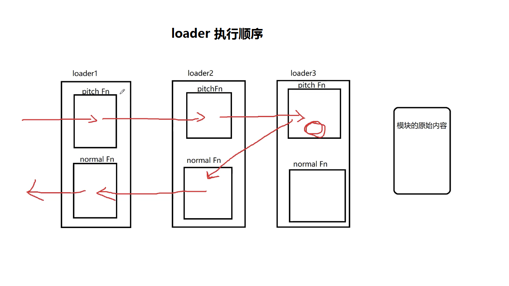

# Customized Loaders
自定义 `loader`

## Introduction
- webpack enables use of loaders to preprocess files. 
  webpack 中使用 `loader` 对打包的文件进行预处理。
- This allows you to bundle any static resource way beyond JavaScript.
  除打包 JavaScript 文件，loader 允许打包其他静态源码。如: .scss, .less, .css, .jep 等文件。 
-  You can easily write your own loaders using Node.js.
  运用 Node.js 很容易写出自定义的 loader。

- `loader` 本质就是一个函数，供 `webpack` 内部调用，并将要进行打包转换的代码 `inputSource` 传入。


## 手写 babel-loader
### 下载依赖
```bash
npm i @babel/core --save-dev
```
### 引入 `@babel/core` 模块
```js
const path = require('path');
```

### 核心 loader 方法
- 接收 `inputSource` 源码参数
- 调用 `babel.transform` 方法
- 传入参数
    - `inputSource`
    - `config`
        - presets 预设属性
        - sourceMap 是否返回源码映射文件
        - filename 提供映射文件 names 属性
```js
const loader = function(inputSource) {
    const config = {
        presets: [ "@babel/preset-env" ],
        sourceMaps: true,
        filename: this.request.split('!')[1].split('/').pop()
    };
    const { code, map, ast } = babel.transform(inputSource, config);
    return this.callback(null, code, map);
}
```

### loader.pitch 方法
`pitch` 方法是可选的

参数
- remainingRequest
- previousRequest
- data

返回值
loader 执行顺序由以下几种`返回值`决定：
- `undefined` 会直接处理源码，跳过后面的 loader 执行
- `!undefined` 按顺序往后执行 loader

```js
loader.pitch = function(remainingRequest, previousRequest, data) {
    data.name = 'stella';
    console.loh('pitch1');
}
```


### 导出函数
```js
module.exports = loader;
```